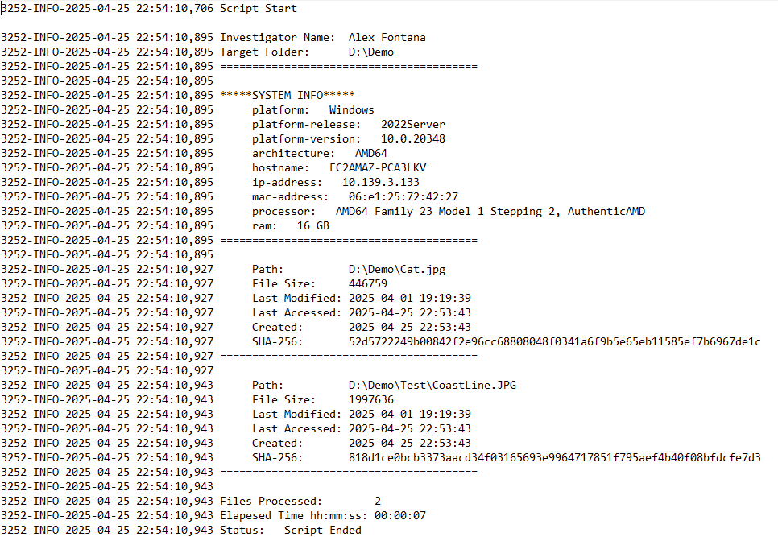

# folder-inspector

## Description

Walks through each entry within user specified folder and returns info regarding the file's size, MAC times, and MD5 Hash. Logs all this info as well as system info, run time, # of enteries, and targeted folder. 

## Usage

Before running the script, user has choice to keep the file name data is logged to as "ScriptLog.txt" as specified on line 14 of index.py, change that string value, or delete and uncomment line 15 to allow user to decide which file data is logged to upon run time. If text file to log data does not exist, or full pathway is not properly specified, the script will create file within same folder as script.

After running, user will be prompted for their name and the full pathway of folder to inspect. User will be informed script has finished running through the terminal. The logged text file should resememble the structure of the one below, but likely with more files.

## License

Please refer to the LICENSE in the repo.